# Darwin-CyberChef-Basics-TryHackMe-Lab

## Overview

This repository documents my completion of the **CyberChef: The Basics** room on TryHackMe. During this hands-on lab, I learned how to use CyberChef to extract indicators of compromise (IOCs), decode encoded data, transform information, and perform common digital forensics and SOC analyst tasks.

---

## Objectives

- Learn the CyberChef interface
- Extract indicators of compromise (IOCs)
- Decode Base64 and URL-encoded data
- Convert UNIX timestamps
- Practice common SOC analyst workflows
- Build hands-on digital forensics skills

---

## Skills Demonstrated

- CyberChef
- Digital Forensics (DFIR)
- Incident Response
- IOC Extraction
- Base64 Decoding
- URL Decoding
- Email Extraction
- IP Address Extraction
- UNIX Timestamp Conversion
- Data Transformation
- Threat Analysis
- SOC Analyst Fundamentals

---

## Tools Used

- CyberChef
- TryHackMe
- Web Browser

---

## Lab Tasks Completed

- Introduction
- Accessing the Tool
- Navigating the Interface
- Before Anything Else
- Practice, Practice, Practice
- Your First Official Cook
- Conclusion

---

# Screenshots

## 01 - CyberChef Room Overview

Shows the CyberChef: The Basics room on TryHackMe before beginning the lab.

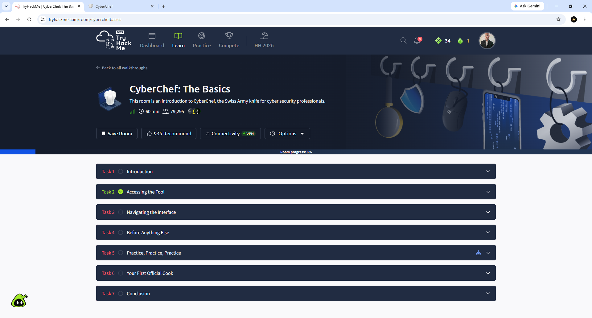

---

## 02 - CyberChef Interface

Overview of the CyberChef workspace including the Operations, Recipe, Input, and Output panels.

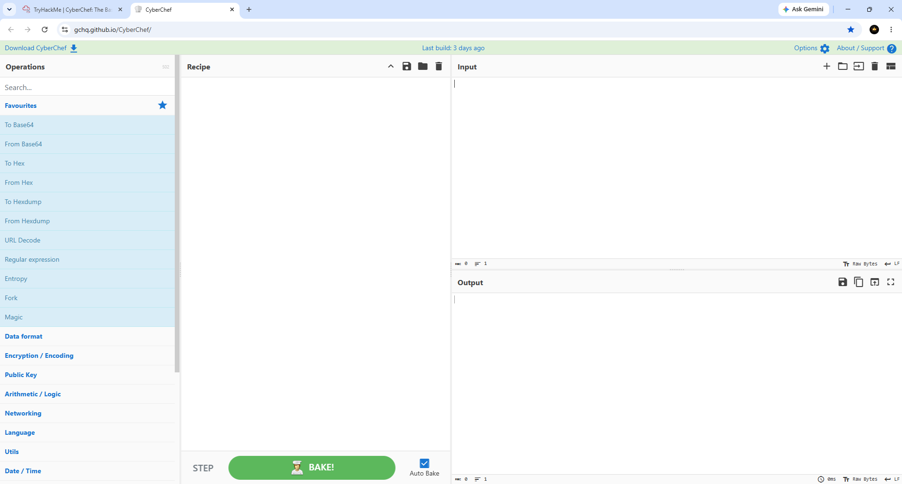

---

## 03 - Task File

Task file used throughout the practical exercises.

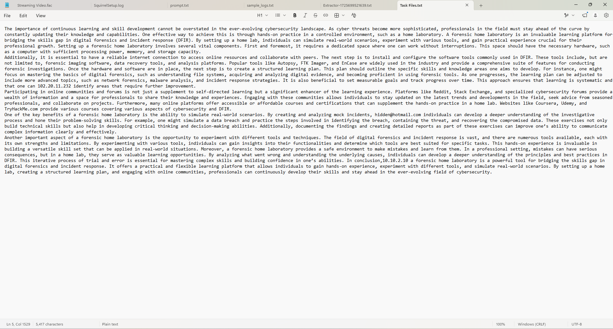

---

## 04 - Extract IP Addresses

Extracted IPv4 addresses from the provided task file using the **Extract IP addresses** operation.

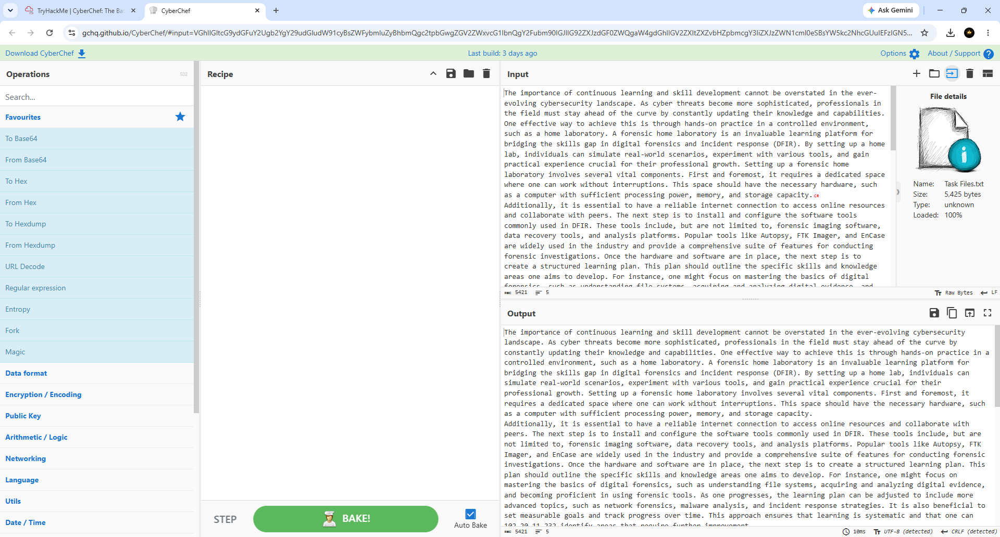

---

## 05 - Extract URLs

Extracted URLs from the task file using the **Extract URLs** operation.

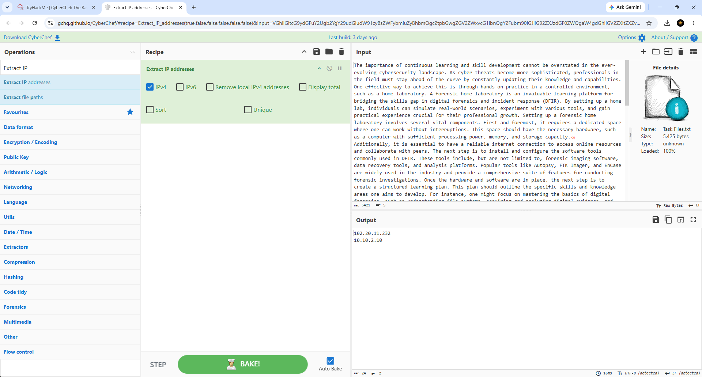

---

## 06 - Extract Email Addresses

Recovered hidden email addresses using the **Extract Email Addresses** operation.

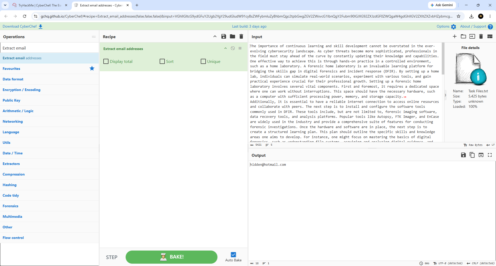

---

## 07 - From Base64

Decoded Base64-encoded text into readable plaintext.

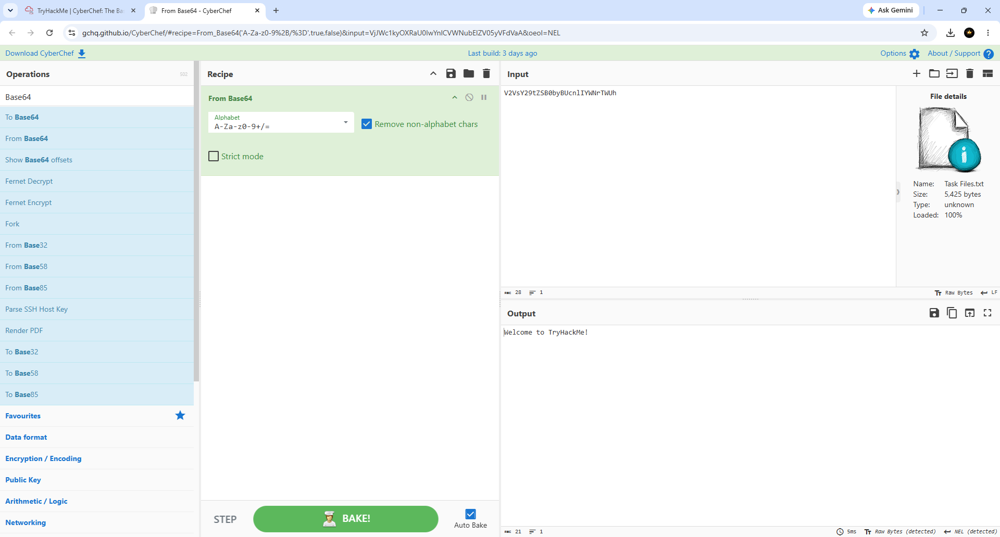

---

## 08 - URL Decode

Decoded URL-encoded values into their original readable format.

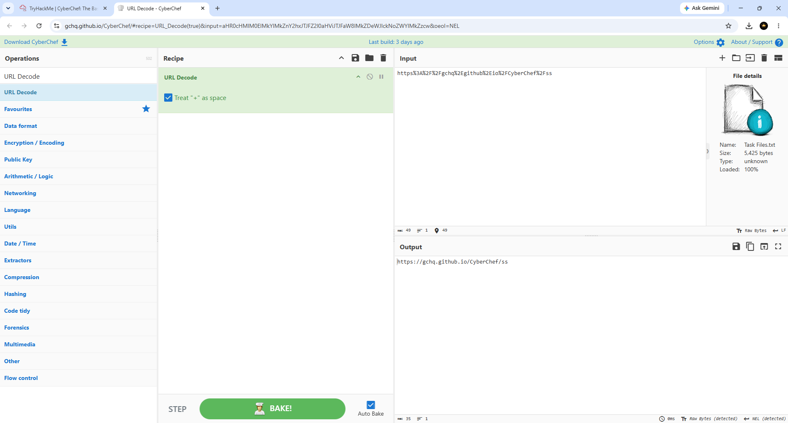

---

## 09 - To UNIX Timestamp

Converted a human-readable date and time into a UNIX timestamp.

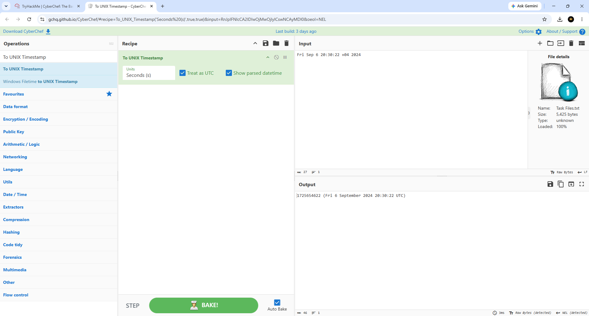

---

## 10 - From UNIX Timestamp

Converted a UNIX timestamp back into a readable date and time.

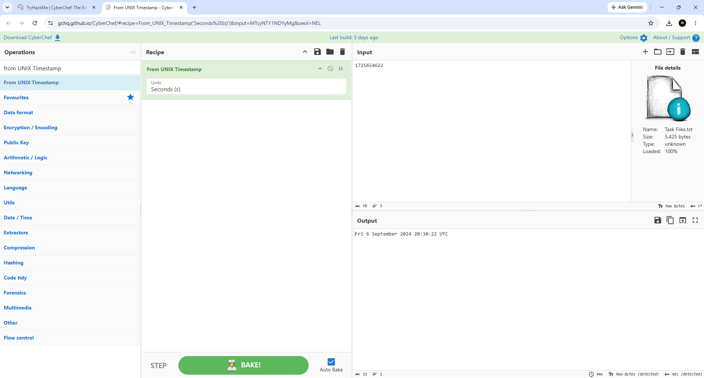

---

## 11 - Practical Exercise Completed

Completed all practical CyberChef exercises involving IOC extraction, decoding, and data transformation.

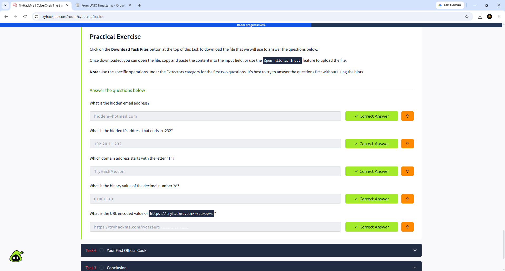

---

## 12 - Your First Official Cook Completed

Successfully completed the "Your First Official Cook" challenge using multiple CyberChef operations.

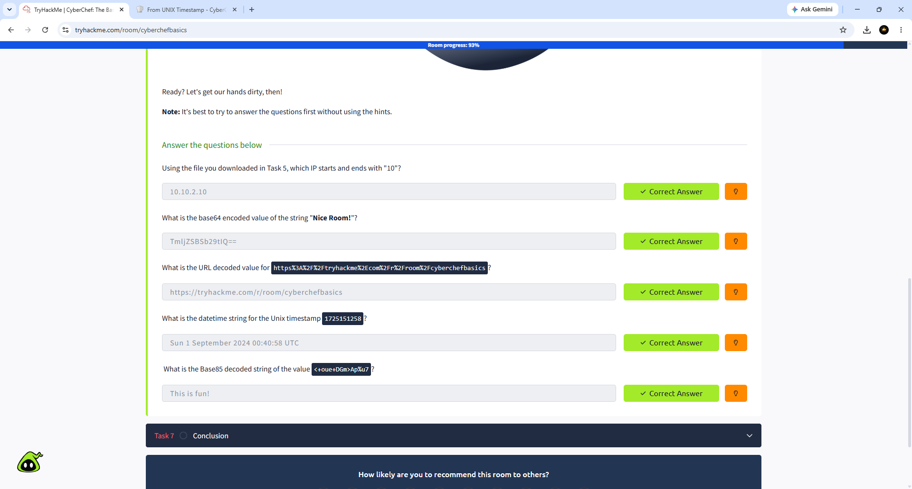

---

## 13 - CyberChef Room Completed (100%)

Successfully completed the CyberChef: The Basics room with 100% completion.

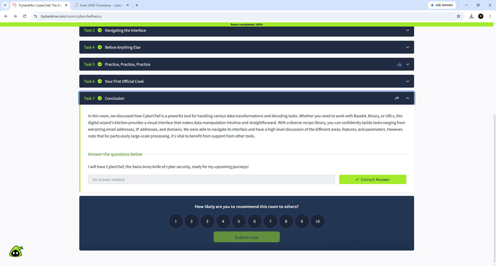

---

# Key Takeaways

- Learned the CyberChef interface and workflow
- Extracted Indicators of Compromise (IOCs)
- Decoded Base64 and URL-encoded data
- Converted UNIX timestamps
- Practiced common SOC analyst and DFIR workflows
- Strengthened cybersecurity investigation skills

---

## Outcome

Successfully completed the **CyberChef: The Basics** room on TryHackMe with **100% completion**, gaining hands-on experience with CyberChef operations commonly used in Security Operations Center (SOC), Digital Forensics (DFIR), and Incident Response investigations.

Author: Darwin Brown JR.

Aspiring SOC Analyst Tier 1
